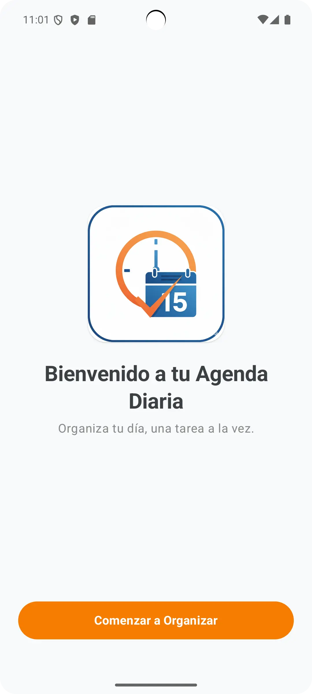
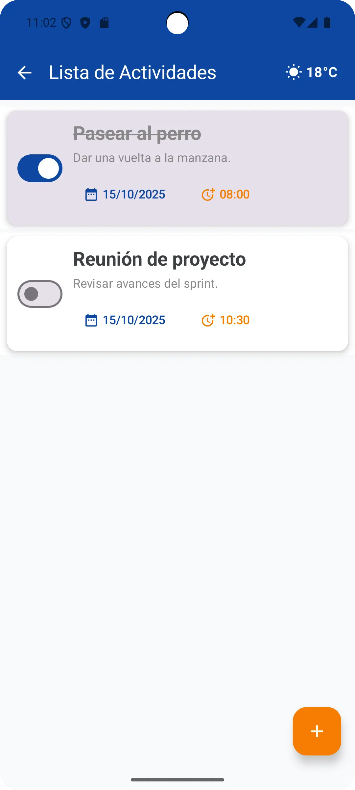
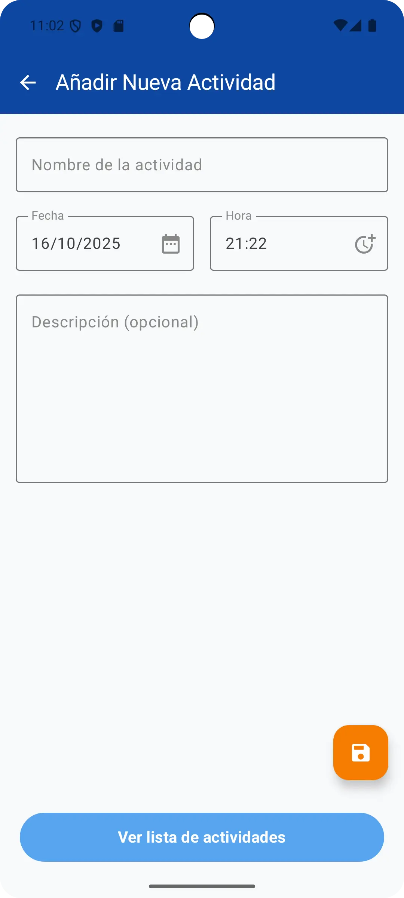
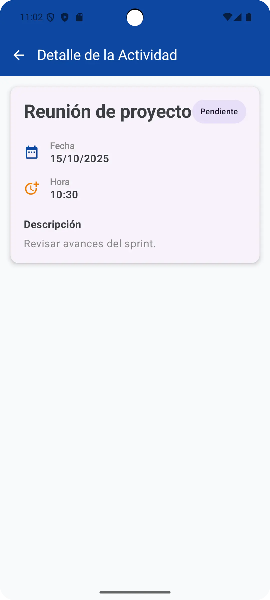

# Agenda Diaria - App de Tareas para Android

<p align="center">
  
</p>

**Agenda Diaria** es una aplicación de gestión de tareas moderna y minimalista para Android, diseñada para ayudarte a organizar tu día de manera eficiente. Creada con las últimas tecnologías recomendadas por Google, esta aplicación ofrece una experiencia de usuario fluida y reactiva.

[](https://kotlinlang.org/)
[](https://developer.android.com/jetpack/compose)
[](https://developer.android.com/jetpack/guide)
[](LICENSE)

---

## 📋 Descripción General

Este proyecto es una aplicación de lista de tareas (To-Do list) que permite a los usuarios registrar, visualizar y gestionar sus actividades diarias. La aplicación está desarrollada nativamente en **Kotlin** y utiliza **Jetpack Compose** para la construcción de la interfaz de usuario, siguiendo la arquitectura **MVVM (Model-View-ViewModel)** para garantizar un código limpio, escalable y fácil de mantener.

La aplicación demuestra la implementación de conceptos clave del desarrollo moderno de Android, como la gestión de estado reactiva, la navegación segura y el manejo de operaciones asíncronas.

## ✨ Características Principales

* **Gestión Completa de Tareas:** Crea, visualiza, actualiza y elimina tareas fácilmente.
* **Formulario Intuitivo:** Añade nuevas tareas con campos para título, descripción, fecha y hora.
* **Validación de Entrada:** Evita la creación de tareas vacías mediante una validación simple en el ViewModel.
* **Estado Reactivo:** La interfaz de usuario se actualiza en tiempo real gracias a **StateFlow**, reflejando al instante cualquier cambio en los datos.
* **Lista Eficiente:** La lista de tareas utiliza `LazyColumn` para un rendimiento óptimo, incluso con una gran cantidad de actividades.
* **Navegación Segura:** Implementación de **Navigation Compose** con rutas serializables para una navegación robusta y sin errores entre pantallas.
* **Simulación de Carga Asíncrona:** Uso de **Corrutinas de Kotlin** para simular la carga de datos desde una fuente remota sin bloquear el hilo principal.
* **Buenas Prácticas de Kotlin:** El código aprovecha características modernas del lenguaje como **funciones de extensión** y **funciones de alcance** (`scope functions`) para ser más conciso y legible.

---

## 🏛️ Arquitectura y Stack Tecnológico

Este proyecto sigue la **arquitectura MVVM (Model-View-ViewModel)**, que separa la lógica de la interfaz de usuario de la lógica de negocio.

* **Model:** Representa la capa de datos de la aplicación (e.g., la clase `Task`).
* **View:** La interfaz de usuario, construida con Composables (`HomeScreen`, `TaskListScreen`, etc.), que observa los cambios en el ViewModel.
* **ViewModel:** (`TaskListViewModel`) Actúa como un puente entre el Modelo y la Vista. Contiene la lógica de negocio y expone el estado de la UI a través de `StateFlow`.

### 🚀 Stack Tecnológico

* **Lenguaje:** [Kotlin](https://kotlinlang.org/)
* **UI Toolkit:** [Jetpack Compose](https://developer.android.com/jetpack/compose) para una UI declarativa y moderna.
* **Arquitectura:** [MVVM (Model-View-ViewModel)](https://developer.android.com/jetpack/guide)
* **Gestión de Estado:** [ViewModel](https://developer.android.com/topic/libraries/architecture/viewmodel) y [StateFlow](https://developer.android.com/kotlin/flow/stateflow-and-sharedflow) para un estado observable y consciente del ciclo de vida.
* **Asincronía:** [Corrutinas de Kotlin](https://kotlinlang.org/docs/coroutines-overview.html) para manejar operaciones en segundo plano.
* **Navegación:** [Navigation Compose](https://developer.android.com/jetpack/compose/navigation) para la navegación entre pantallas.
* **Diseño:** [Material 3](https://m3.material.io/) para los componentes de la interfaz de usuario.

---

## 📸 Capturas de Pantalla


| Pantalla de Inicio | Lista de Actividades | Añadir Tarea | Detalle de la Actividad |
| :----------------: | :---------------: | :------------: | :------------: |
|  |  |  |  |

---

## 🛠️ Cómo Empezar

Para compilar y ejecutar este proyecto en tu máquina local, sigue estos pasos:

1.  **Clona el repositorio:**
    ```bash
    git clone [https://github.com/tu-usuario/AgendaDiaria.git](https://github.com/tu-usuario/AgendaDiaria.git)
    ```
2.  **Abre el proyecto en Android Studio:**
    * Abre Android Studio (se recomienda la versión Hedgehog o superior).
    * Selecciona `File > Open` y navega hasta el directorio donde clonaste el proyecto.
3.  **Sincroniza Gradle:**
    * Android Studio debería sincronizar automáticamente los archivos de Gradle. Si no es así, puedes hacerlo manualmente desde `File > Sync Project with Gradle Files`.
4.  **Ejecuta la aplicación:**
    * Selecciona un emulador o conecta un dispositivo físico.
    * Presiona el botón `Run 'app'` (o `Shift + F10`).

---

## 📜 Licencia

Este proyecto está licenciado bajo la Licencia MIT. Consulta el archivo `LICENSE` para más detalles.